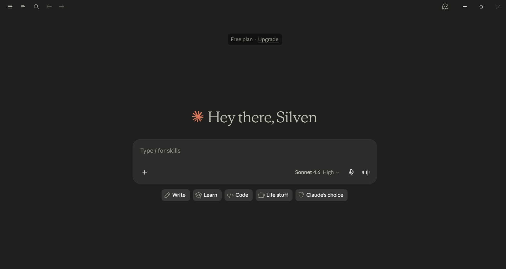
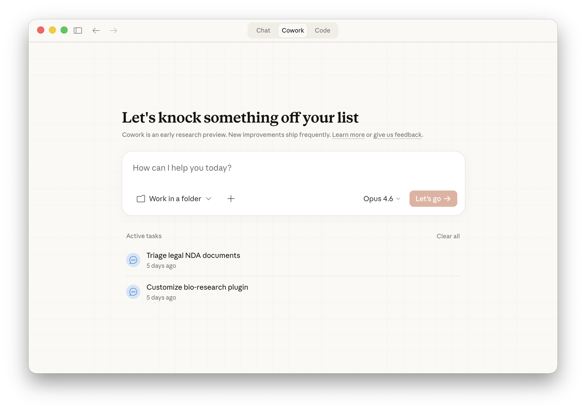
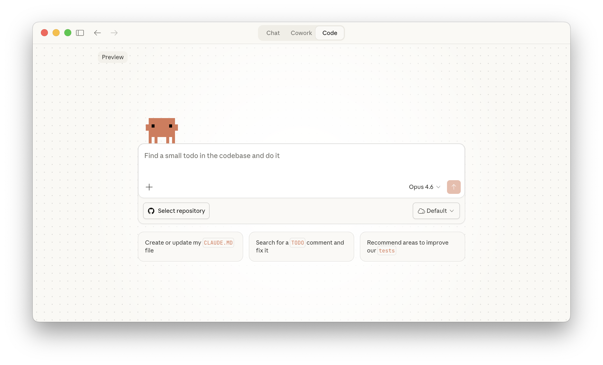

# Claude 101 - Certification Course

---

## What is Claude?:

Claude is an AI assistant that follows principles(known as **Constitutional AI**).

### Prompting to Claude:
There is a specific prompting style for claude:

>
>	* Setting the stage(your role, objectives, context)
>	* Defining the task
>	* Specifying the rules
>

We may upload relevant documents for better response.

* Claude supports various file types like: ***DOCX, CSV, TXT, MD, XLSX,....***

### The 4D Framework for AI Fluency:
This help us make most out of AI interactions.

>    * Delegation: Deciding what works should be done by humans and what by AI.
> 
>   * Description: Communicating effectively with AI systems by providing required outputs, processes,..
> 
>   * Discernment: Evaluating interactions, outputs, quality, and determining the areas for improvement.
>
>   * Diligence: Using AI reasonably and ethically.

### Claude Chat:
Chat excels when we want to brainstorm ideas, draft the documents, or work through problems back and forth.

### Claude CoWork:
In CoWork, Claude can spin up multiple sub-agents to multitask, pulling info from many sources and produce something finished.

In Cowork:

* **Folder Access**: Claude will get access to the olders in your computer and can work on them.  
  
* **Scheduled Tasks**: Claude can spin up multiple sub agents in the backgroung to complete the scheduled tasks.  
  
* **Browser Use**: Claude can use browser to navigate through websites, interct with pages and pull required content.

* **Plugins**: Plugins provide capabillites for Claude that can't be done alone.

* **Protected Environment**: Coworks in a contained space in the computer.

### Claude Code:
Claude Code gives us full development environment for building software.

Via Code, Claude can directly write and modify the code and showing visual diffs. This contains built-in terminal in which claude can run commands and track everything using git.

While Cowork works in a contained space Claude Code has full access to the file system, project, terminal. Claude Code run locally and remote by connecting a GitHub repo in cloud environment. Sessions will continue in the cloud even if the app is closed.

## Projects
Projects are dedicated workspaces with their own memory, chat history, knowledge base, and custom instructions for ongoing work.

### When to Use Projects:
Use Projects when you have:

> Ongoing workflows
> Reusable reference documents
> Consistent response requirements
> Team collaboration needs

### Creating a Project:
Create a new project.
> Add a name, description, and visibility.
> Configure Project Instructions.
> Upload documents to the Knowledge Base.

### Project Instructions:
Instructions define Claude's behavior across all chats.

Include:
> Project context
> Workflow/process
> Tone & writing style
> Specific requirements

Project instructions can also automate recurring workflows.

### Knowledge Base:
Upload documents Claude should reference throughout the project.

Supported content includes:
***PDF, DOCX, CSV, TXT, HTML, Google Drive files, and more.***

Good uploads include:
> Brand guidelines
> Research reports
> Meeting notes
> Templates
> Technical documentation
> Example work

* Tip: Use descriptive filenames for better retrieval.

### Retrieval Augmented Generation (RAG):
When the knowledge base becomes large, Claude automatically enables RAG.

RAG:
> Retrieves only relevant information.
> Expands project capacity by up to 10×.
> Maintains response quality automatically.

### Working in a Project:
Every chat automatically:

> Uses the project knowledge base.
> Follows the project instructions.
> Collaboration (Claude for Work):

Projects can be shared with teammates.

#### Permission levels:
> Can View – Read and chat only.
> Can Edit – Modify instructions, files, and members.
> Owner – Full control over the project.

## Artifacts

**Artifacts** are standalone, interactive outputs that Claude displays in a dedicated window, making them easy to **view, edit, reuse, and share**.

### When Claude Creates an Artifact:

Claude automatically creates an artifact when the content:

> * Is significant and self-contained (typically 15+ lines)
> * Is intended for editing or reuse
> * Represents complex standalone content
> * Will likely be referenced later

### Common Artifact Types:

* **Documents** – Markdown, TXT, Word, PDF, PowerPoint, Excel
* **Code Snippets** – Python, C, JavaScript, C++, etc.
* **HTML Pages** – Complete web pages with HTML, CSS & JavaScript
* **SVG Images** – Logos, icons, illustrations
* **Mermaid Diagrams** – Flowcharts, sequence diagrams, Gantt charts
* **React Components** – Interactive apps, dashboards, calculators, games

### Creating an Artifact:

Simply describe what you want.

Examples:

> * Create a flowchart.
> * Build an interactive dashboard.
> * Design a landing page.
> * Write a reusable project template.

If Claude replies in chat instead, ask:

> **"Create this as an artifact."**

### Artifact Features:

* Preview the output
* View underlying code
* Copy content
* Download files

### Sharing Artifacts:

Artifacts can be:

* **Copied or Downloaded**
* **Shared within an organization** (Claude for Work)
* **Published publicly**

Public artifacts:

> * Only the selected artifact is shared.
> * Original chat remains private.
> * Anyone with the link can use it.
> * Others can remix and modify it.
> * Can be unpublished anytime.

### Best Practices:

> * Be specific about requirements.
> * Describe the intended users.
> * Improve artifacts incrementally.
> * Explicitly request an artifact if needed.

## Skills

**Skills** are reusable packages of **instructions, scripts, and resources** that Claude dynamically loads to perform specialized tasks consistently.

> **Projects store knowledge, Skills execute processes.**

### Types of Skills:

* **Anthropic Skills** – Built-in Skills for creating Word, Excel, PowerPoint, and PDF files.
* **Custom Skills** – User-created Skills for specialized workflows, brand guidelines, and organizational processes.

### Enabling Skills:

To use Skills:

> * Enable **Code Execution & File Creation**.
> * Go to **Settings → Capabilities → Skills**.
> * Turn individual Skills on or off.

> **Availability:** Pro, Max, Team, and Enterprise plans.

### Using Skills:

Claude automatically selects the appropriate Skill based on your prompt.

Examples:

> * Create an Excel spreadsheet with formulas.
> * Convert meeting notes into PowerPoint.
> * Generate a PDF report.
> * Build a financial model.

Outputs are downloadable and can also be saved to **Google Drive**.

### File Execution:

Claude can work with uploaded:

* **DOCX**
* **PPTX**
* **XLSX**
* **PDF**

Claude creates an updated version of the file (does not overwrite the original).

### Security:

> * Install Custom Skills only from trusted sources.
> * Anthropic Skills are officially maintained.
> * Custom Skills remain private to your account.
> * Review external Skills before using them.

### Creating Custom Skills:

Create Skills by chatting with Claude.

Steps:

1. Describe the workflow.
2. Answer Claude's questions.
3. Upload templates or reference files.
4. Save the generated Skill.

Claude will automatically use the Skill for relevant future tasks.

### Projects vs Skills:

| Projects | Skills |
|----------|---------|
| Store knowledge | Execute processes |
| Long-term context | Repeatable workflows |
| Reference materials | Step-by-step methodology |
| Shared project memory | Automatic task execution |

> **Project = What Claude knows.**  
> **Skill = How Claude works.**

## Connectors

**Connectors** allow Claude to securely access your apps, files, and data, transforming it from an assistant into an **informed collaborator**.

### Key Features:

> * Access your existing tools and data.
> * Read information and perform actions.
> * Reduce manual copying and pasting.
> * Work directly within connected applications.

### Model Context Protocol (MCP):

**MCP** is an open standard that powers Connectors.

> * Acts like **USB-C for AI**.
> * Provides a universal interface for connecting applications.
> * Allows developers to build compatible connectors.

### Types of Connectors:

* **Web Connectors** – Connect cloud services such as Google Drive, Gmail, Notion, Slack, Asana, Stripe, etc.
* **Desktop Extensions** – Connect local files, native applications, and system features through the Claude Desktop app.

### Setting Up a Web Connector:

1. Open the **Connectors Directory**.
2. Select a connector.
3. Sign in to the service.
4. Grant required permissions.
5. Test the connection.

### Desktop Extensions:

Requirements:

> * Install the **Claude Desktop App**.
> * Navigate to **Settings → Extensions**.
> * Install and configure the desired extension.

Desktop extensions can provide:

* Local file access
* Browser automation
* Native application integration

### Common Use Cases:

**Project Management**

> * View tasks
> * Create tasks
> * Track project status

**Communication**

> * Search emails
> * Draft replies
> * Summarize conversations

**Documentation**

> * Search documents
> * Summarize notes
> * Retrieve guidelines

**Business Tools**

> * Analyze revenue
> * Track opportunities
> * View transactions

### Security & Permissions:

> * Permissions are scoped to the connector.
> * Claude only accesses data you already have permission to view.
> * Access can be revoked at any time.
> * Install custom connectors only from trusted sources.

## Enterprise Search

**Enterprise Search** is an organization-wide knowledge search feature that lets Claude search, retrieve, and synthesize information across your company's connected tools.

> Think of it as a **pre-built Project** containing your organization's knowledge.

> **Availability:** Team and Enterprise plans (requires admin setup).

### Key Features:

> * Searches across multiple connected data sources.
> * Synthesizes information into a single response.
> * Provides source citations.
> * Uses organization-specific instructions for accurate results.

### Common Use Cases:

**Getting Up to Speed**

> * Summarize recent updates.
> * Review project status.
> * Identify current blockers.

**Policies & Processes**

> * Company policies
> * Expense procedures
> * Leave request process

**Research & Analysis**

> * Competitor analysis
> * Product roadmap discussions
> * Customer onboarding information

**Onboarding**

> * Learn internal systems.
> * Find responsible team members.
> * Understand organizational workflows.

**Project Tracking**

> * Search project discussions.
> * Summarize meeting decisions.
> * Track team contributions.

### How It Works:

Claude searches across connected services such as:

* Google Drive
* SharePoint
* Slack
* Gmail
* Microsoft Teams
* Other connected enterprise tools

### Setup Process:

**For Admins:**

1. Open **Ask Your Organization**.
2. Connect organization tools.
3. Configure project name and description.
4. Finish setup for the workspace.

**For Users:**

1. Open **Ask {Organization Name}**.
2. Authenticate connected services.
3. Start asking organization-related questions.

> More connected services provide more comprehensive search results.

### Security:

> * Claude only accesses information you already have permission to view.
> * Conversations remain private.
> * Connected organizational data is not stored or indexed separately.

## Research

**Research** enables Claude to perform **agentic, multi-step investigations**, gathering information from multiple sources to produce comprehensive, cited reports.

### Key Features:

> * Conducts multiple searches automatically.
> * Explores different perspectives and follows new leads.
> * Combines **Extended Thinking** with information gathering.
> * Produces detailed reports with verifiable citations.
> * Typically completes in **5–15 minutes** (up to 45 minutes for complex tasks).

### When to Use Research:

Use Research for:

> * Comprehensive reports
> * Multi-source analysis
> * Market & competitor research
> * Technical documentation
> * Project planning
> * Verified, citation-backed information

### When to Use Other Features:

| Feature | Best Used For |
|---------|---------------|
| **Research** | Multi-source investigations and detailed reports |
| **Web Search** | Quick facts or simple lookups |
| **Extended Thinking** | Deep reasoning without external information |
| **Enterprise Search** | Searching internal organizational knowledge |

### How Research Works:

1. **Plan** – Claude analyzes the problem using Extended Thinking.
2. **Investigate** – Performs multiple searches, adapting based on findings.
3. **Synthesize** – Combines information into a structured report.
4. **Cite** – Provides source citations for every major claim.

### Using Research:

1. Enable **Research** from the **+ menu**.
2. Ensure **Web Search** is enabled.
3. Enter your research prompt.
4. Claude researches in the background and generates a report.

### Writing Effective Research Prompts:

> * Clearly define the objective.
> * Specify the desired report structure.
> * Include constraints (budget, timeline, location, etc.).
> * Ask Claude to refine your prompt if needed.

### Research with Connected Integrations:

Research can combine web results with connected services such as:

* Google Drive
* Gmail
* Google Calendar
* Slack
* Other connected integrations

Examples:

> * Summarize discussions across emails and Slack.
> * Research companies on your upcoming calendar.
> * Compare internal documents with industry best practices.

> **Tip:** Disable Web Search to perform **internal-only research** using connected organizational data.

## Claude Use Cases

Claude can streamline work across multiple professions by automating repetitive tasks, analyzing information, and generating high-quality content.

### General Professional Use:

> * Generate project status reports.
> * Analyze customer feedback and survey responses.
> * Create reusable Skills for brand guidelines.

### Sales:

> * Build competitive battle cards.
> * Prepare for sales meetings.
> * Generate sales and pipeline reports.

### Marketing:

> * Analyze campaign performance.
> * Repurpose content across platforms and audiences.

### Finance:

> * Build financial models.
> * Draft investment memos.
> * Understand and enhance complex spreadsheets.

### Human Resources (HR):

> * Create role-specific onboarding guides.
> * Develop employee documentation.

### Legal:

> * Track discovery timelines.
> * Analyze legal documents and identify patterns.

### Research:

> * Plan literature reviews.
> * Verify statistical analyses from raw data.

### Learn More:

> * Explore the **Use Case Gallery** for detailed, role-specific workflows and practical examples.

## Claude Products

Claude is available through multiple specialized products, each designed for specific workflows and work environments.

### Claude Code

An **agentic coding assistant** that works in your **terminal, IDE, browser, and Slack**.

Best for:

> * Building features from natural language.
> * Debugging code.
> * Exploring unfamiliar codebases.
> * Automating development tasks.
> * Running tests and managing Git workflows.

### @Claude

Integrates Claude directly into **Slack**.

Best for:

> * Summarizing conversations.
> * Drafting replies.
> * Preparing for meetings.
> * Understanding team discussions.
> * Launching Claude Code sessions from Slack.

### Claude Design

Creates **interactive UI prototypes** from text descriptions, sketches, or screenshots.

Best for:

> * Rapid UI prototyping.
> * Exploring design ideas.
> * Refining layouts and interactions.
> * Creating design-system-aware interfaces.

### Claude for Microsoft 365

Claude integrates directly into Microsoft applications through sidebars.

**Excel**

> * Analyze spreadsheets.
> * Debug formulas.
> * Create charts and pivot tables.
> * Build financial models.

**PowerPoint**

> * Generate presentations.
> * Improve slide content.
> * Reorganize decks.
> * Apply consistent formatting.

**Word**

> * Draft documents.
> * Edit and restructure content.
> * Work with tracked changes.
> * Reference connected sources.

**Outlook (Beta)**

> * Summarize email threads.
> * Draft contextual replies.
> * Organize inbox tasks.
> * Generate action items.

### Claude in Chrome

A **Chrome extension** that provides Claude as a browser sidebar.

Best for:

> * Summarizing web pages.
> * Assisting with emails.
> * Automating repetitive browser tasks.
> * Testing websites.
> * Maintaining context across tabs.

> **Note:** Currently in **Public Beta** and intended for low-risk tasks.

### Product Comparison

| Product | Best For | Platform |
|---------|----------|----------|
| **Claude.ai** | General AI tasks, research, writing, analysis | Web, Desktop, Mobile |
| **Claude Code** | Software development | Terminal, IDE, Browser |
| **Claude Cowork** | Multi-step workflows & automation | Desktop, Mobile |
| **@Claude** | Team collaboration | Slack |
| **Claude Design** | UI prototyping | Web |
| **Claude for Microsoft 365** | Document editing & productivity | Excel, Word, PowerPoint, Outlook |
| **Claude in Chrome** | Web assistance & browser automation | Chrome |

# Completed:

